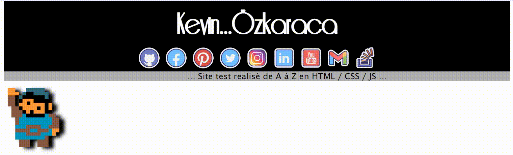

## Test en javascript

 

### Présentation

Petit projet pour tester la fonction map, random et le translate en CSS. Mauvaises pratiques pour le SEO, les détails dans le code

### Le resultat :

    <a href= "https://kevinozkaraca.github.io/Test_Javascript/">  Cliquer ici pour voir le site </a>

La démonstrastion en image :

